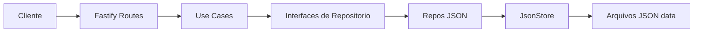
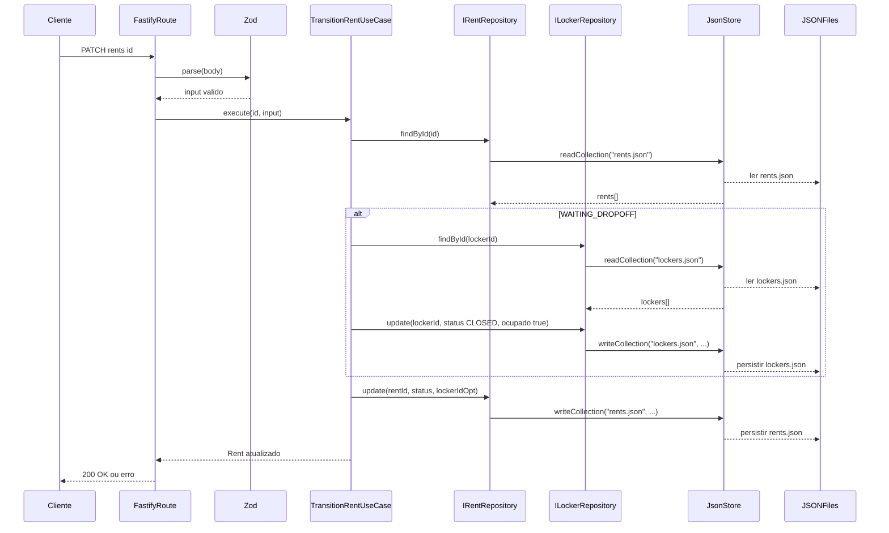

# Bloqit SW Engineering Challenge

Este projeto é um backend HTTP em TypeScript (Fastify) organizado por *features* e inspirado em *Clean/Hexagonal Architecture*: as regras de negócio vivem em *Use Cases* (camada de aplicação) e dependem de *portas* (interfaces de repositório). A infraestrutura (ex.: persistência em JSON) fica isolada como *adapters*, permitindo testes e evolução com baixo acoplamento.

## Como executar

- Instale dependências: `npm install`
- Start: `npm run dev`
- Testes: `npm test`
- Typecheck + lint + testes: `npm run typecheck && npm run lint && npm test`

## 1. Visão Geral da Arquitetura

### Padrão adotado

- *Modular por Features* (por domínio: `bloqs`, `lockers`, `rents`)
- Estrutura estilo *Clean/Hexagonal*:
  - **Adapter HTTP**: rotas Fastify + validação (Zod)
  - **Application**: Use Cases orquestram regras de negócio
  - **Domain**: entidades, validações de transição e `DomainError` (erros de negócio)
  - **Infrastructure**: implementações de repositório (ex.: JSON)
  - **Shared**: utilitários transversais (ex.: `findEntity`, `JsonStore`, handler de erro)

> [!IMPORTANT]
> O “contrato” entre o domínio e a infraestrutura é feito por interfaces de repositório em `domain/`. Isso torna a camada de negócio testável e intercambiável (ex.: trocar JSON por banco sem reescrever Use Cases).

### Diagrama (Blocos)



## 2. Estrutura de Pastas e Coesão

### Árvore de diretórios (visão geral)

```text
src/
  core/
    app.ts                 # composição (wiring) do servidor e injeção de dependências
    server.ts              # bootstrap do listen
    plugins/
      error-handler.ts     # mapeia DomainError/ZodError para HTTP
  shared/
    application/
      find-entity.ts       # lança erro de domínio quando entidade não existe
    infrastructure/
      json-store.ts        # leitura/escrita genérica de coleções JSON
    utils/
      domain-error-handler.ts # base de DomainError (código e status HTTP)
  modules/
    bloqs/
      application/
        *.use-case.ts
      domain/
        bloq.ts
        bloq.repository.ts
        bloq.errors.ts
      infra/
        bloq.routes.ts
        bloq.json-repository.ts
    lockers/
      application/
        *.use-case.ts
      domain/
        locker.ts
        locker.repository.ts
        locker.errors.ts
      infra/
        locker.routes.ts
        locker.json-repository.ts
    rents/
      application/
        *.use-case.ts
      domain/
        rent.ts
        rent.repository.ts
        rent.errors.ts
      infra/
        rent.routes.ts
        rent.json-repository.ts

tests/
  modules/
    <feature>/
      application/
        *.spec.ts            # unit tests de Use Cases
      infra/
        *.spec.ts            # testes de rotas e integração com infraestrutura
```

### Por que isso sustenta *scalability* e *strategic swings*

- **Baixo acoplamento entre features**: cada módulo encapsula regras e portas próprias (`src/modules/<feature>/...`). Mudanças em `rents` não exigem refatorar `lockers`, exceto quando um contrato comum muda.
- **Troca de infraestrutura com impacto local**: como os Use Cases dependem de interfaces (portas), substituir a persistência (JSON -> DB) altera apenas adapters.
- **Evolução incremental**: adicionar uma nova feature segue um padrão repetível: `domain/`, `application/`, `infra/` (e rotas). Isso reduz risco durante mudanças grandes (*strategic swings*).

> [!NOTE]
> O “composition root” está em `src/core/app.ts`, centralizando o wiring. Isso evita espalhar dependências pelo projeto e simplifica alterações no bootstrapping.

## 3. Fluxo de uma Funcionalidade (Feature Flow)

### Feature escolhida: `TransitionRent` (PATCH `/rents/:id`)

O ciclo de vida de uma requisição para transicionar o status de um rent é:

1. O **Cliente HTTP** chama `PATCH /rents/:id` com `{ status, lockerId? }`
2. A **Fastify Route** valida o body com **Zod**
3. A rota chama o **`TransitionRentUseCase`** via `execute(id, input)`
4. O use case:
   - Carrega o `Rent` via `rentRepo.findById` (helper `findEntity` converte `undefined` em erro de domínio)
   - Valida a transição permitida por `VALID_TRANSITIONS`
   - Para `WAITING_DROPOFF`: exige `lockerId`, carrega o `Locker`, valida estado (`OPEN` e `isOccupied=false`) e então atualiza o locker para `CLOSED/isOccupied=true`
   - Para `WAITING_PICKUP`: exige que `rent.lockerId` exista (ignora `lockerId` do body, preservando a imutabilidade do vínculo)
   - Para `DELIVERED`: carrega o locker referenciado por `rent.lockerId`, valida `isOccupied=true` e então atualiza o locker para `OPEN/isOccupied=false`
   - Atualiza o `Rent` no repositório com o novo `status` (e `lockerId` apenas quando aplicável)
5. Se o domínio lançar `DomainError`, o handler central converte para HTTP consistente (status code e `domainCode`).

> [!IMPORTANT]
> Mesmo sem transações de banco (persistência é em JSON), o use case aplica *guards* e invariantes para evitar “partial updates” quando uma condição de negócio falha.

### Diagrama (Sequence Diagram)



## 4. Estratégia de Testes

### Onde residem os testes

- **Unit tests (Use Cases)**:
  - `tests/modules/<feature>/application/*.spec.ts`
  - Ex.: `tests/modules/rents/application/transition-rent.use-case.spec.ts`
  - Normalmente usa mocks das portas (`IRentRepository`, `ILockerRepository`) para isolar a lógica.

- **Integração de fatia (HTTP -> Use Case)**:
  - `tests/modules/<feature>/infra/*.routes.spec.ts`
  - Ex.: `tests/modules/rents/infra/rent.routes.spec.ts`
  - Executa Fastify com `supertest`, com repositórios mockados, validando Zod e mapeamento de `DomainError` para HTTP.

- **Integração com infraestrutura (persistência real em JSON)**:
  - `tests/modules/rents/infra/transition-rent.persistence-invariants.spec.ts`
  - Usa `JsonStore` + repositórios JSON reais em diretório temporário para garantir invariantes do fluxo (ex.: ausência de updates parciais quando *guards* falham).

> [!NOTE]
> Não há um conjunto explícito de testes e2e que suba o servidor completo com persistência real e execute uma jornada HTTP inteira abrangente. A cobertura é por camadas e invariantes: domínio/unit, rotas com mocks, e alguns testes com infraestrutura real.

### Como a arquitetura favorece a testabilidade

- **Use Cases dependem de interfaces**: você troca repositórios por mocks nos unit tests.
- **Error handling previsível**: `DomainError` padroniza `domainCode` e `httpStatus`, tornando asserts estáveis.
- **Composition root bem definido**: testes montam Fastify apenas com as rotas e o `error-handler`.
- **Funções utilitárias compartilhadas**: `findEntity` reduz boilerplate e garante que “not found” vira erro de domínio consistente.

## 5. Padrões de Projeto e Decisões Técnicas

### Padrões aplicados (e trade-offs)

1. **Repository Pattern + Ports & Adapters**
   - Interfaces em `src/modules/<feature>/domain/*.repository.ts`
   - Implementações em `src/modules/<feature>/infra/*json-repository.ts`
   - Trade-off: abstrações extras (interfaces e adapters) em troca de isolamento e troca de persistência.

2. **Dependency Injection (injeção por construtor)**
   - Use Cases recebem portas no construtor (ex.: `TransitionRentUseCase(rentRepo, lockerRepo)`).
   - Trade-off: cria mais “operação de wiring” (instanciar dependências), mitigada pelo `src/core/app.ts` e pelas rotas de cada feature.

3. **Domain Error Pattern + Error Handling Central**
   - O domínio lança `DomainError` (com `domainCode` e `httpStatus`).
   - `src/core/plugins/error-handler.ts` converte para HTTP (e também trata `ZodError`).
   - Trade-off: centraliza regras de tradução HTTP; para regras complexas, manter consistência entre domínio e error handler exige disciplina.

> [!IMPORTANT]
> Trade-off relevante: como a persistência é em arquivos JSON e as atualizações ocorrem em múltiplas escritas, não há garantia transacional entre agregados (ex.: `locker` e depois `rent`). O projeto mitiga isso com *guards* do use case e testes de invariantes.